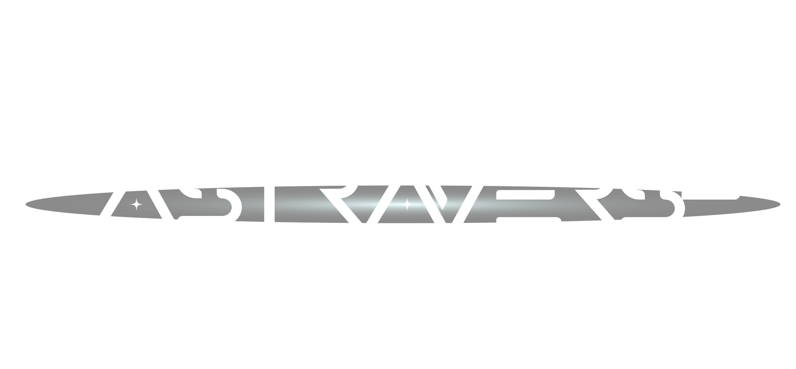

# 

This project aims to provide an interactive web visualisation of the Solar System, allowing users to explore celestial bodies, learn fascinating facts, and embark on a virtual journey through space.

## Overview

The Solar System visualisation offers users an immersive experience, allowing them to:

- Explore celestial bodies at their own pace.
- Interact with 3D models of the various celestial bodies.
- Discover interesting facts and details about each celestial bodies.
- Navigate through different sections to learn more about space exploration through scrolling.

## Features

- Interactive 3D models: Users can explore high-quality 3D models of celestial bodies in the solar system.
- Educational content: Each celestial body comes with detailed information and fun facts, providing users with an engaging learning experience.
- User-friendly interface: The web visualisation is designed with ease of use in mind, ensuring that users can navigate and interact with the content effortlessly.

## Usage

To use the solar system visualisation, simply open the provided web application in your preferred web browser. Navigate through the interface to explore different celestial bodies, click on objects for more information, and enjoy the immersive experience.

## Acknowledgements/Credits

  <ul>
    <li>Thanks to <a href="https://science.nasa.gov/solar-system/resources/?types=3d">NASA Solar System Resources</a> for the 3D models of the various celestial bodies</li>
    <li>Thanks to <a href="https://sketchfab.com/3d-models/astronaut-floating-in-space-8d486996594a4714be1adf0d20745aa4">nitwit.friends</a> for the 3D model of the astronaut</li>
    <li>Thanks to <a href="https://sketchfab.com/3d-models/sci-fi-concept-spaceship-bbbcc8c64ed140dc872ca0fdf1c89134">Aditya Graphical</a> for the 3D model of the spacecraft</li>
    <li>Thanks to <a href="https://stock.adobe.com/sg/images/futuristic-font-alphabet-letters-future-logo-typography-creative-minimalist-typographic-design-cropped-letters-set-for-science-technology-space-research-logo-type-hud-text-headline-scifi-cover/443446514">artyway</a> for the vector font for AstraVerse logo</li>
    <li>Thanks to <a href="https://fonts.google.com/specimen/Livvic">Gogole Font</a> for the web font used</li>
	<li>Thanks to <a href="https://codepen.io/ykadosh/pen/GRwLKvV">Yoav Kadosh</a> for the Solar Eclispe present at the starting page.</li>
	<li>Thanks to <a href="https://codepen.io/frexuz/pen/eYvBVW">Kristian Gerardsson</a> for the use of starfield as the background for this project.</li>
    <li>Inspired by our fascination with space and exploration.</li>
  </ul>
